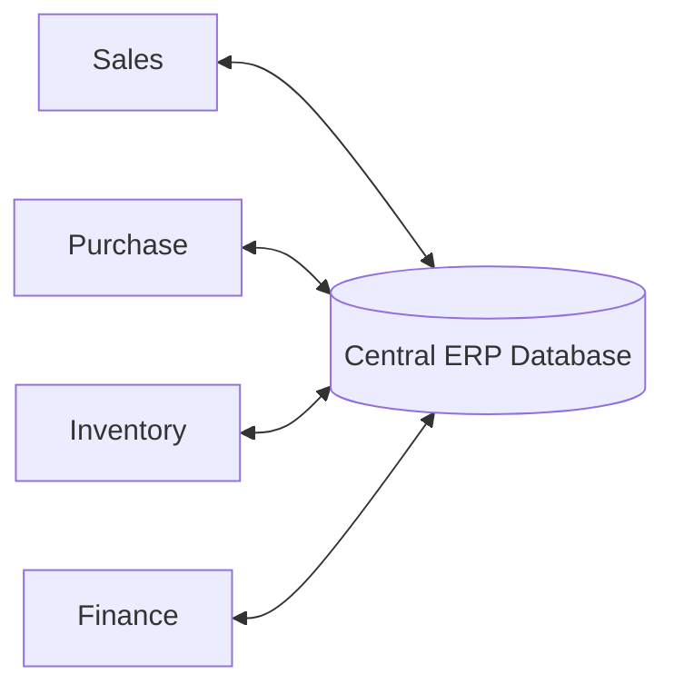
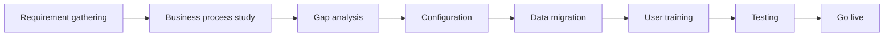
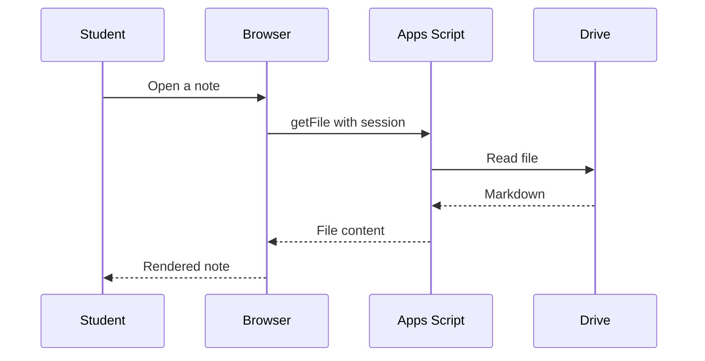

# Diagram Check

Dev-only note with diagrams of different widths (see src/dev/demo.js).

## Hub (left to right)

```mermaid
flowchart LR
  DB[("Central ERP Database")]
  S[Sales] <--> DB
  P[Purchase] <--> DB
  I[Inventory] <--> DB
  F[Finance] <--> DB
```

## Long chain (left to right)

```mermaid
flowchart LR
  A[Requirement gathering] --> B[Business process study] --> C[Gap analysis] --> D[Configuration] --> E[Data migration] --> F[User training] --> G[Testing] --> H[Go live]
```

## Sequence (cannot turn)

```mermaid
sequenceDiagram
  participant Student
  participant Browser
  participant AppsScript as Apps Script
  participant Drive
  Student->>Browser: Open a note
  Browser->>AppsScript: getFile with session
  AppsScript->>Drive: Read file
  Drive-->>AppsScript: Markdown
  AppsScript-->>Browser: File content
  Browser-->>Student: Rendered note
```
